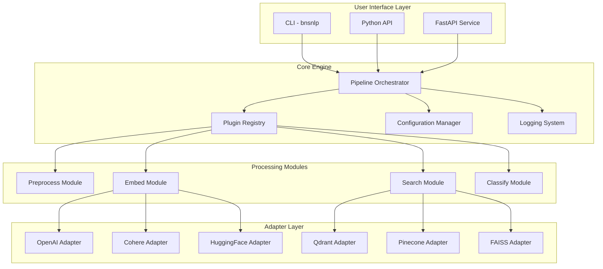

# Design Document

## Overview

bns-nlp-engine, Türkçe NLP için modüler, plugin tabanlı bir Python kütüphanesidir. Mimari, core engine, plugin registry, adapter pattern ve pipeline orchestration üzerine kuruludur. Kütüphane hem programatik API hem de CLI ve opsiyonel FastAPI servisi olarak kullanılabilir.

### Core Design Principles

1. **Modularity**: Her modül (preprocess, embed, search, classify) bağımsız çalışabilir
2. **Extensibility**: Plugin sistemi ile core'u değiştirmeden yeni özellikler eklenebilir
3. **Type Safety**: Pydantic ve type hints ile güçlü tip kontrolü
4. **Async-First**: I/O-bound işlemler için async/await desteği
5. **Performance**: Batch processing, streaming, multiprocessing/threading, GPU desteği
6. **Privacy**: Telemetry varsayılan olarak kapalı, veri toplama yok

## Architecture

### High-Level Architecture




### Package Structure

```
bns-nlp-engine/
├── src/
│   └── bnsnlp/
│       ├── __init__.py
│       ├── __version__.py
│       ├── core/
│       │   ├── __init__.py
│       │   ├── pipeline.py          # Pipeline orchestrator
│       │   ├── registry.py          # Plugin registry
│       │   ├── config.py            # Configuration management
│       │   ├── exceptions.py        # Custom exceptions
│       │   └── types.py             # Common type definitions
│       ├── preprocess/
│       │   ├── __init__.py
│       │   ├── base.py              # Base preprocessor interface
│       │   ├── normalizer.py        # Text normalization
│       │   ├── tokenizer.py         # Tokenization
│       │   ├── lemmatizer.py        # Turkish lemmatization
│       │   └── stopwords.py         # Stop word removal
│       ├── embed/
│       │   ├── __init__.py
│       │   ├── base.py              # Base embedder interface
│       │   ├── openai.py            # OpenAI adapter
│       │   ├── cohere.py            # Cohere adapter
│       │   └── huggingface.py       # HuggingFace adapter
│       ├── search/
│       │   ├── __init__.py
│       │   ├── base.py              # Base search interface
│       │   ├── qdrant.py            # Qdrant adapter
│       │   ├── pinecone.py          # Pinecone adapter
│       │   └── faiss.py             # FAISS adapter
│       ├── classify/
│       │   ├── __init__.py
│       │   ├── base.py              # Base classifier interface
│       │   ├── intent.py            # Intent classification
│       │   └── entity.py            # Entity extraction
│       ├── cli/
│       │   ├── __init__.py
│       │   └── main.py              # CLI implementation
│       ├── api/
│       │   ├── __init__.py
│       │   └── service.py           # FastAPI service
│       └── utils/
│           ├── __init__.py
│           ├── logging.py           # Logging utilities
│           ├── async_utils.py       # Async helpers
│           └── performance.py       # Performance utilities
├── tests/
│   ├── unit/
│   ├── integration/
│   └── conftest.py
├── examples/
│   ├── notebooks/
│   │   ├── quickstart.ipynb
│   │   ├── preprocessing.ipynb
│   │   ├── embeddings.ipynb
│   │   └── search.ipynb
│   └── fastapi_service/
│       ├── main.py
│       └── requirements.txt
├── docs/
│   ├── index.md
│   ├── api/
│   ├── guides/
│   └── plugins/
├── pyproject.toml
├── setup.py
├── README.md
├── LICENSE
├── CHANGELOG.md
└── .github/
    └── workflows/
        ├── ci.yml
        └── publish.yml
```


## Components and Interfaces

### 1. Plugin Registry System

The registry manages plugin discovery, registration, and lifecycle.

```python
from typing import Protocol, Type, Dict, Any
from abc import ABC, abstractmethod

class PluginInterface(Protocol):
    """Base protocol for all plugins"""
    name: str
    version: str
    
    def initialize(self, config: Dict[str, Any]) -> None:
        """Initialize plugin with configuration"""
        ...

class PluginRegistry:
    """Central registry for managing plugins"""
    
    def __init__(self):
        self._plugins: Dict[str, Dict[str, Type[PluginInterface]]] = {
            'preprocess': {},
            'embed': {},
            'search': {},
            'classify': {}
        }
    
    def register(self, category: str, name: str, plugin_class: Type[PluginInterface]) -> None:
        """Register a plugin"""
        ...
    
    def get(self, category: str, name: str) -> Type[PluginInterface]:
        """Retrieve a registered plugin"""
        ...
    
    def discover_plugins(self) -> None:
        """Discover plugins via entry_points"""
        ...
    
    def list_plugins(self, category: str = None) -> Dict[str, list]:
        """List all registered plugins"""
        ...
```

Entry points in pyproject.toml:
```toml
[project.entry-points."bnsnlp.preprocess"]
normalizer = "bnsnlp.preprocess.normalizer:TurkishNormalizer"

[project.entry-points."bnsnlp.embed"]
openai = "bnsnlp.embed.openai:OpenAIEmbedder"
cohere = "bnsnlp.embed.cohere:CohereEmbedder"
huggingface = "bnsnlp.embed.huggingface:HuggingFaceEmbedder"

[project.entry-points."bnsnlp.search"]
qdrant = "bnsnlp.search.qdrant:QdrantSearch"
pinecone = "bnsnlp.search.pinecone:PineconeSearch"
faiss = "bnsnlp.search.faiss:FAISSSearch"
```


### 2. Configuration System

Pydantic-based configuration with YAML and environment variable support.

```python
from pydantic import BaseModel, Field, validator
from typing import Optional, Dict, Any, Literal
from pathlib import Path
import yaml
import os

class LoggingConfig(BaseModel):
    level: Literal["DEBUG", "INFO", "WARNING", "ERROR"] = "INFO"
    format: Literal["json", "text"] = "json"
    output: str = "stdout"

class TelemetryConfig(BaseModel):
    enabled: bool = False
    endpoint: Optional[str] = None

class PreprocessConfig(BaseModel):
    lowercase: bool = True
    remove_punctuation: bool = True
    remove_stopwords: bool = True
    lemmatize: bool = True
    batch_size: int = 32

class EmbedConfig(BaseModel):
    provider: str = "openai"
    model: str = "text-embedding-3-small"
    batch_size: int = 16
    use_gpu: bool = True
    api_key: Optional[str] = Field(None, env="BNSNLP_EMBED_API_KEY")

class SearchConfig(BaseModel):
    provider: str = "faiss"
    top_k: int = 10
    similarity_threshold: float = 0.7

class Config(BaseModel):
    logging: LoggingConfig = LoggingConfig()
    telemetry: TelemetryConfig = TelemetryConfig()
    preprocess: PreprocessConfig = PreprocessConfig()
    embed: EmbedConfig = EmbedConfig()
    search: SearchConfig = SearchConfig()
    
    @classmethod
    def from_yaml(cls, path: Path) -> "Config":
        """Load configuration from YAML file"""
        with open(path) as f:
            data = yaml.safe_load(f)
        return cls(**data)
    
    @classmethod
    def from_env(cls) -> "Config":
        """Load configuration from environment variables"""
        # Environment variables override YAML
        ...
```


### 3. Pipeline Orchestrator

Manages execution flow and coordinates modules.

```python
from typing import List, Dict, Any, Optional, AsyncIterator
from pydantic import BaseModel

class PipelineStep(BaseModel):
    module: str  # 'preprocess', 'embed', 'search', 'classify'
    plugin: str  # specific plugin name
    config: Dict[str, Any] = {}

class Pipeline:
    """Orchestrates NLP processing pipeline"""
    
    def __init__(self, config: Config, registry: PluginRegistry):
        self.config = config
        self.registry = registry
        self.steps: List[PipelineStep] = []
    
    def add_step(self, module: str, plugin: str, config: Dict[str, Any] = None) -> "Pipeline":
        """Add a processing step to pipeline"""
        step = PipelineStep(module=module, plugin=plugin, config=config or {})
        self.steps.append(step)
        return self
    
    async def process(self, input_data: Any) -> Any:
        """Process data through pipeline"""
        result = input_data
        for step in self.steps:
            plugin_class = self.registry.get(step.module, step.plugin)
            plugin = plugin_class(config=step.config)
            result = await plugin.process(result)
        return result
    
    async def process_batch(self, inputs: List[Any]) -> List[Any]:
        """Process batch of inputs"""
        ...
    
    async def process_stream(self, inputs: AsyncIterator[Any]) -> AsyncIterator[Any]:
        """Process streaming inputs"""
        async for item in inputs:
            yield await self.process(item)
```


### 4. Preprocess Module

Turkish text preprocessing with normalization, tokenization, and lemmatization.

```python
from abc import ABC, abstractmethod
from typing import List, Union
from pydantic import BaseModel

class PreprocessResult(BaseModel):
    text: str
    tokens: List[str]
    metadata: dict = {}

class BasePreprocessor(ABC):
    """Base interface for preprocessors"""
    
    def __init__(self, config: Dict[str, Any]):
        self.config = config
    
    @abstractmethod
    async def process(self, text: Union[str, List[str]]) -> Union[PreprocessResult, List[PreprocessResult]]:
        """Process text or batch of texts"""
        ...

class TurkishPreprocessor(BasePreprocessor):
    """Turkish-specific preprocessing"""
    
    def __init__(self, config: Dict[str, Any]):
        super().__init__(config)
        self.normalizer = TurkishNormalizer()
        self.lemmatizer = TurkishLemmatizer()
        self.stopwords = load_turkish_stopwords()
    
    async def process(self, text: Union[str, List[str]]) -> Union[PreprocessResult, List[PreprocessResult]]:
        if isinstance(text, list):
            return await self._process_batch(text)
        return await self._process_single(text)
    
    async def _process_single(self, text: str) -> PreprocessResult:
        # Normalize Turkish characters
        normalized = self.normalizer.normalize(text)
        
        # Lowercase
        if self.config.get('lowercase', True):
            normalized = normalized.lower()
        
        # Tokenize
        tokens = self._tokenize(normalized)
        
        # Remove punctuation
        if self.config.get('remove_punctuation', True):
            tokens = [t for t in tokens if not self._is_punctuation(t)]
        
        # Remove stopwords
        if self.config.get('remove_stopwords', True):
            tokens = [t for t in tokens if t not in self.stopwords]
        
        # Lemmatize
        if self.config.get('lemmatize', True):
            tokens = [self.lemmatizer.lemmatize(t) for t in tokens]
        
        return PreprocessResult(
            text=' '.join(tokens),
            tokens=tokens,
            metadata={'original_length': len(text)}
        )
```


### 5. Embed Module

Adapter pattern for multiple embedding providers.

```python
from abc import ABC, abstractmethod
from typing import List, Union
import numpy as np
from pydantic import BaseModel

class EmbedResult(BaseModel):
    embeddings: List[List[float]]
    model: str
    dimensions: int

class BaseEmbedder(ABC):
    """Base interface for embedders"""
    
    @abstractmethod
    async def embed(self, texts: Union[str, List[str]]) -> EmbedResult:
        """Generate embeddings for text(s)"""
        ...

class OpenAIEmbedder(BaseEmbedder):
    """OpenAI embedding adapter"""
    
    def __init__(self, config: Dict[str, Any]):
        self.api_key = config.get('api_key')
        self.model = config.get('model', 'text-embedding-3-small')
        self.batch_size = config.get('batch_size', 16)
        self.client = AsyncOpenAI(api_key=self.api_key)
    
    async def embed(self, texts: Union[str, List[str]]) -> EmbedResult:
        if isinstance(texts, str):
            texts = [texts]
        
        # Batch processing
        embeddings = []
        for i in range(0, len(texts), self.batch_size):
            batch = texts[i:i + self.batch_size]
            response = await self.client.embeddings.create(
                input=batch,
                model=self.model
            )
            embeddings.extend([e.embedding for e in response.data])
        
        return EmbedResult(
            embeddings=embeddings,
            model=self.model,
            dimensions=len(embeddings[0])
        )

class HuggingFaceEmbedder(BaseEmbedder):
    """Local HuggingFace model adapter with GPU support"""
    
    def __init__(self, config: Dict[str, Any]):
        self.model_name = config.get('model', 'sentence-transformers/paraphrase-multilingual-MiniLM-L12-v2')
        self.use_gpu = config.get('use_gpu', True)
        self.device = 'cuda' if self.use_gpu and torch.cuda.is_available() else 'cpu'
        self.model = SentenceTransformer(self.model_name, device=self.device)
    
    async def embed(self, texts: Union[str, List[str]]) -> EmbedResult:
        if isinstance(texts, str):
            texts = [texts]
        
        # Run in thread pool to avoid blocking
        loop = asyncio.get_event_loop()
        embeddings = await loop.run_in_executor(
            None,
            lambda: self.model.encode(texts, convert_to_numpy=True)
        )
        
        return EmbedResult(
            embeddings=embeddings.tolist(),
            model=self.model_name,
            dimensions=embeddings.shape[1]
        )
```


### 6. Search Module

Vector database adapters for semantic search.

```python
from abc import ABC, abstractmethod
from typing import List, Dict, Any, Optional
from pydantic import BaseModel

class SearchResult(BaseModel):
    id: str
    score: float
    text: str
    metadata: Dict[str, Any] = {}

class SearchResponse(BaseModel):
    results: List[SearchResult]
    query_time_ms: float

class BaseSearch(ABC):
    """Base interface for search backends"""
    
    @abstractmethod
    async def index(self, texts: List[str], embeddings: List[List[float]], 
                   ids: List[str], metadata: List[Dict[str, Any]] = None) -> None:
        """Index documents with embeddings"""
        ...
    
    @abstractmethod
    async def search(self, query_embedding: List[float], top_k: int = 10,
                    filters: Dict[str, Any] = None) -> SearchResponse:
        """Search for similar documents"""
        ...

class QdrantSearch(BaseSearch):
    """Qdrant vector database adapter"""
    
    def __init__(self, config: Dict[str, Any]):
        self.url = config.get('url', 'http://localhost:6333')
        self.collection = config.get('collection', 'bnsnlp')
        self.client = AsyncQdrantClient(url=self.url)
    
    async def index(self, texts: List[str], embeddings: List[List[float]], 
                   ids: List[str], metadata: List[Dict[str, Any]] = None) -> None:
        points = [
            PointStruct(
                id=id_,
                vector=emb,
                payload={'text': text, **(meta or {})}
            )
            for id_, emb, text, meta in zip(ids, embeddings, texts, metadata or [{}]*len(texts))
        ]
        await self.client.upsert(collection_name=self.collection, points=points)
    
    async def search(self, query_embedding: List[float], top_k: int = 10,
                    filters: Dict[str, Any] = None) -> SearchResponse:
        import time
        start = time.time()
        
        results = await self.client.search(
            collection_name=self.collection,
            query_vector=query_embedding,
            limit=top_k,
            query_filter=filters
        )
        
        return SearchResponse(
            results=[
                SearchResult(
                    id=str(r.id),
                    score=r.score,
                    text=r.payload.get('text', ''),
                    metadata=r.payload
                )
                for r in results
            ],
            query_time_ms=(time.time() - start) * 1000
        )

class FAISSSearch(BaseSearch):
    """Local FAISS index adapter"""
    
    def __init__(self, config: Dict[str, Any]):
        self.index_path = config.get('index_path', 'faiss.index')
        self.dimension = config.get('dimension', 768)
        self.index = faiss.IndexFlatL2(self.dimension)
        self.documents: Dict[int, Dict[str, Any]] = {}
```


### 7. Classify Module

Intent classification and entity extraction for Turkish.

```python
from abc import ABC, abstractmethod
from typing import List, Dict, Any
from pydantic import BaseModel

class Entity(BaseModel):
    text: str
    type: str
    start: int
    end: int
    confidence: float

class ClassifyResult(BaseModel):
    intent: str
    intent_confidence: float
    entities: List[Entity]

class BaseClassifier(ABC):
    """Base interface for classifiers"""
    
    @abstractmethod
    async def classify(self, text: str) -> ClassifyResult:
        """Classify intent and extract entities"""
        ...

class TurkishClassifier(BaseClassifier):
    """Turkish intent and entity classifier"""
    
    def __init__(self, config: Dict[str, Any]):
        self.intent_model = config.get('intent_model')
        self.entity_model = config.get('entity_model')
        self.device = 'cuda' if config.get('use_gpu', True) and torch.cuda.is_available() else 'cpu'
        
        # Load models
        self.intent_pipeline = pipeline('text-classification', model=self.intent_model, device=self.device)
        self.entity_pipeline = pipeline('ner', model=self.entity_model, device=self.device, aggregation_strategy='simple')
    
    async def classify(self, text: str) -> ClassifyResult:
        loop = asyncio.get_event_loop()
        
        # Run in thread pool
        intent_result = await loop.run_in_executor(None, lambda: self.intent_pipeline(text)[0])
        entity_results = await loop.run_in_executor(None, lambda: self.entity_pipeline(text))
        
        entities = [
            Entity(
                text=e['word'],
                type=e['entity_group'],
                start=e['start'],
                end=e['end'],
                confidence=e['score']
            )
            for e in entity_results
        ]
        
        return ClassifyResult(
            intent=intent_result['label'],
            intent_confidence=intent_result['score'],
            entities=entities
        )
```


### 8. CLI Implementation

Command-line interface using Click or Typer.

```python
import typer
from typing import Optional
from pathlib import Path
import json
import sys

app = typer.Typer(name="bnsnlp", help="Turkish NLP Engine CLI")

@app.command()
def preprocess(
    input: Optional[str] = typer.Option(None, "--input", "-i", help="Input text or file path"),
    config: Optional[Path] = typer.Option(None, "--config", "-c", help="Config file path"),
    output: Optional[Path] = typer.Option(None, "--output", "-o", help="Output file path"),
    verbose: bool = typer.Option(False, "--verbose", "-v", help="Verbose output")
):
    """Preprocess Turkish text"""
    # Read from stdin if no input provided
    text = input or sys.stdin.read()
    
    # Load config
    cfg = Config.from_yaml(config) if config else Config()
    
    # Process
    preprocessor = TurkishPreprocessor(cfg.preprocess.dict())
    result = asyncio.run(preprocessor.process(text))
    
    # Output
    output_data = result.dict()
    if output:
        with open(output, 'w') as f:
            json.dump(output_data, f, ensure_ascii=False, indent=2)
    else:
        print(json.dumps(output_data, ensure_ascii=False, indent=2))

@app.command()
def embed(
    input: Optional[str] = typer.Option(None, "--input", "-i"),
    provider: str = typer.Option("openai", "--provider", "-p"),
    config: Optional[Path] = typer.Option(None, "--config", "-c"),
    output: Optional[Path] = typer.Option(None, "--output", "-o")
):
    """Generate embeddings for text"""
    ...

@app.command()
def search(
    query: str = typer.Argument(..., help="Search query"),
    provider: str = typer.Option("faiss", "--provider", "-p"),
    top_k: int = typer.Option(10, "--top-k", "-k"),
    config: Optional[Path] = typer.Option(None, "--config", "-c")
):
    """Search for similar documents"""
    ...

@app.command()
def classify(
    input: Optional[str] = typer.Option(None, "--input", "-i"),
    config: Optional[Path] = typer.Option(None, "--config", "-c"),
    output: Optional[Path] = typer.Option(None, "--output", "-o")
):
    """Classify intent and extract entities"""
    ...

if __name__ == "__main__":
    app()
```


### 9. FastAPI Service

Optional REST API service.

```python
from fastapi import FastAPI, HTTPException, BackgroundTasks
from fastapi.middleware.cors import CORSMiddleware
from pydantic import BaseModel
from typing import List, Optional

app = FastAPI(
    title="bns-nlp-engine API",
    description="Turkish NLP Engine REST API",
    version="1.0.0"
)

app.add_middleware(
    CORSMiddleware,
    allow_origins=["*"],
    allow_methods=["*"],
    allow_headers=["*"]
)

# Request/Response models
class PreprocessRequest(BaseModel):
    text: str
    lowercase: bool = True
    remove_punctuation: bool = True
    remove_stopwords: bool = True
    lemmatize: bool = True

class EmbedRequest(BaseModel):
    texts: List[str]
    provider: str = "openai"
    model: Optional[str] = None

class SearchRequest(BaseModel):
    query: str
    top_k: int = 10
    provider: str = "faiss"
    filters: Optional[dict] = None

class ClassifyRequest(BaseModel):
    text: str

# Endpoints
@app.post("/preprocess")
async def preprocess_endpoint(request: PreprocessRequest):
    """Preprocess Turkish text"""
    try:
        preprocessor = TurkishPreprocessor(request.dict())
        result = await preprocessor.process(request.text)
        return result
    except Exception as e:
        raise HTTPException(status_code=500, detail=str(e))

@app.post("/embed")
async def embed_endpoint(request: EmbedRequest):
    """Generate embeddings"""
    try:
        embedder = get_embedder(request.provider, request.dict())
        result = await embedder.embed(request.texts)
        return result
    except Exception as e:
        raise HTTPException(status_code=500, detail=str(e))

@app.post("/search")
async def search_endpoint(request: SearchRequest):
    """Semantic search"""
    try:
        # First embed the query
        embedder = get_embedder("openai", {})
        embed_result = await embedder.embed(request.query)
        
        # Then search
        searcher = get_searcher(request.provider, {})
        results = await searcher.search(
            query_embedding=embed_result.embeddings[0],
            top_k=request.top_k,
            filters=request.filters
        )
        return results
    except Exception as e:
        raise HTTPException(status_code=500, detail=str(e))

@app.post("/classify")
async def classify_endpoint(request: ClassifyRequest):
    """Classify intent and extract entities"""
    try:
        classifier = TurkishClassifier({})
        result = await classifier.classify(request.text)
        return result
    except Exception as e:
        raise HTTPException(status_code=500, detail=str(e))

@app.get("/health")
async def health_check():
    """Health check endpoint"""
    return {"status": "healthy", "version": "1.0.0"}
```


## Data Models

### Core Data Models

```python
from pydantic import BaseModel, Field, validator
from typing import List, Dict, Any, Optional, Union
from datetime import datetime
from enum import Enum

class ProcessingStatus(str, Enum):
    PENDING = "pending"
    PROCESSING = "processing"
    COMPLETED = "completed"
    FAILED = "failed"

class Document(BaseModel):
    """Represents a document in the system"""
    id: str
    text: str
    metadata: Dict[str, Any] = {}
    created_at: datetime = Field(default_factory=datetime.utcnow)
    processed: bool = False
    
    class Config:
        json_encoders = {
            datetime: lambda v: v.isoformat()
        }

class ProcessingJob(BaseModel):
    """Represents a processing job"""
    job_id: str
    status: ProcessingStatus
    input_documents: List[str]  # Document IDs
    pipeline_config: Dict[str, Any]
    created_at: datetime = Field(default_factory=datetime.utcnow)
    completed_at: Optional[datetime] = None
    error: Optional[str] = None

class BatchResult(BaseModel):
    """Result of batch processing"""
    job_id: str
    total: int
    successful: int
    failed: int
    results: List[Any]
    errors: List[Dict[str, str]] = []
```


## Error Handling

### Exception Hierarchy

```python
class BNSNLPError(Exception):
    """Base exception for all bns-nlp-engine errors"""
    def __init__(self, message: str, code: str = "BNSNLP_ERROR", context: Dict[str, Any] = None):
        self.message = message
        self.code = code
        self.context = context or {}
        super().__init__(self.message)

class ConfigurationError(BNSNLPError):
    """Configuration related errors"""
    def __init__(self, message: str, context: Dict[str, Any] = None):
        super().__init__(message, "CONFIG_ERROR", context)

class PluginError(BNSNLPError):
    """Plugin loading/registration errors"""
    def __init__(self, message: str, context: Dict[str, Any] = None):
        super().__init__(message, "PLUGIN_ERROR", context)

class ProcessingError(BNSNLPError):
    """Text processing errors"""
    def __init__(self, message: str, context: Dict[str, Any] = None):
        super().__init__(message, "PROCESSING_ERROR", context)

class AdapterError(BNSNLPError):
    """External service adapter errors"""
    def __init__(self, message: str, context: Dict[str, Any] = None):
        super().__init__(message, "ADAPTER_ERROR", context)

class ValidationError(BNSNLPError):
    """Data validation errors"""
    def __init__(self, message: str, context: Dict[str, Any] = None):
        super().__init__(message, "VALIDATION_ERROR", context)
```

### Error Handling Strategy

1. **Retry Logic**: Exponential backoff for transient failures (network, rate limits)
2. **Circuit Breaker**: Prevent cascading failures for external services
3. **Graceful Degradation**: Fall back to simpler methods when advanced features fail
4. **Detailed Logging**: Log all errors with context for debugging
5. **User-Friendly Messages**: Translate technical errors to actionable messages


## Testing Strategy

### Test Pyramid

```
                    /\
                   /  \
                  / E2E \          (5%)  - End-to-end tests
                 /______\
                /        \
               /Integration\       (25%) - Integration tests
              /____________\
             /              \
            /  Unit Tests    \    (70%) - Unit tests
           /__________________\
```

### Unit Tests (70% coverage target)

- **Core Components**: Pipeline, Registry, Config
- **Modules**: Each module (preprocess, embed, search, classify) independently
- **Utilities**: Logging, async helpers, performance utilities
- **Mocking**: Mock external APIs (OpenAI, Cohere, Qdrant, Pinecone)

```python
# Example unit test
import pytest
from bnsnlp.preprocess import TurkishPreprocessor

@pytest.mark.asyncio
async def test_turkish_preprocessor_lowercase():
    config = {'lowercase': True, 'remove_punctuation': False}
    preprocessor = TurkishPreprocessor(config)
    
    result = await preprocessor.process("Merhaba DÜNYA")
    
    assert result.text == "merhaba dünya"
    assert result.tokens == ["merhaba", "dünya"]

@pytest.mark.asyncio
async def test_turkish_preprocessor_batch():
    config = {'lowercase': True}
    preprocessor = TurkishPreprocessor(config)
    
    texts = ["Merhaba", "Dünya"]
    results = await preprocessor.process(texts)
    
    assert len(results) == 2
    assert results[0].text == "merhaba"
```

### Integration Tests (25% coverage target)

- **Adapter Integration**: Test real API calls (with test credentials)
- **Pipeline Flow**: Test complete pipeline execution
- **Database Operations**: Test vector database operations

```python
@pytest.mark.integration
@pytest.mark.asyncio
async def test_openai_embedder_integration():
    config = {'api_key': os.getenv('OPENAI_API_KEY'), 'model': 'text-embedding-3-small'}
    embedder = OpenAIEmbedder(config)
    
    result = await embedder.embed("Merhaba dünya")
    
    assert len(result.embeddings) == 1
    assert result.dimensions > 0
    assert result.model == 'text-embedding-3-small'
```

### End-to-End Tests (5% coverage target)

- **CLI Commands**: Test CLI with real inputs
- **API Endpoints**: Test FastAPI service
- **Complete Workflows**: Test realistic user scenarios

```python
@pytest.mark.e2e
def test_cli_preprocess_command(tmp_path):
    input_file = tmp_path / "input.txt"
    input_file.write_text("Merhaba DÜNYA!")
    
    output_file = tmp_path / "output.json"
    
    result = subprocess.run(
        ["bnsnlp", "preprocess", "-i", str(input_file), "-o", str(output_file)],
        capture_output=True
    )
    
    assert result.returncode == 0
    assert output_file.exists()
```

### Test Configuration

```python
# conftest.py
import pytest
import asyncio

@pytest.fixture(scope="session")
def event_loop():
    """Create event loop for async tests"""
    loop = asyncio.get_event_loop_policy().new_event_loop()
    yield loop
    loop.close()

@pytest.fixture
def mock_openai_client(mocker):
    """Mock OpenAI client"""
    mock = mocker.patch('bnsnlp.embed.openai.AsyncOpenAI')
    mock.return_value.embeddings.create.return_value = MockEmbeddingResponse()
    return mock

@pytest.fixture
def sample_turkish_text():
    """Sample Turkish text for testing"""
    return "Türkçe doğal dil işleme kütüphanesi"
```


## Performance Optimization

### 1. Batch Processing

```python
class BatchProcessor:
    """Efficient batch processing with configurable batch size"""
    
    def __init__(self, batch_size: int = 32):
        self.batch_size = batch_size
    
    async def process_batches(self, items: List[Any], process_fn) -> List[Any]:
        """Process items in batches"""
        results = []
        for i in range(0, len(items), self.batch_size):
            batch = items[i:i + self.batch_size]
            batch_results = await process_fn(batch)
            results.extend(batch_results)
        return results
```

### 2. Streaming Processing

```python
async def process_stream(input_stream: AsyncIterator[str], 
                        pipeline: Pipeline) -> AsyncIterator[Any]:
    """Process streaming data without loading all into memory"""
    async for item in input_stream:
        result = await pipeline.process(item)
        yield result
```

### 3. Multiprocessing for CPU-bound Tasks

```python
from concurrent.futures import ProcessPoolExecutor
import multiprocessing

class MultiprocessingExecutor:
    """Execute CPU-bound tasks across multiple processes"""
    
    def __init__(self, max_workers: int = None):
        self.max_workers = max_workers or multiprocessing.cpu_count()
        self.executor = ProcessPoolExecutor(max_workers=self.max_workers)
    
    async def execute(self, func, items: List[Any]) -> List[Any]:
        """Execute function across multiple processes"""
        loop = asyncio.get_event_loop()
        results = await loop.run_in_executor(
            self.executor,
            lambda: [func(item) for item in items]
        )
        return results
```

### 4. GPU Acceleration

```python
class GPUAccelerator:
    """Manage GPU resources for model inference"""
    
    def __init__(self):
        self.device = 'cuda' if torch.cuda.is_available() else 'cpu'
        self.gpu_available = torch.cuda.is_available()
    
    def to_device(self, tensor):
        """Move tensor to GPU if available"""
        return tensor.to(self.device)
    
    def batch_inference(self, model, inputs, batch_size: int = 32):
        """Efficient batch inference on GPU"""
        model = model.to(self.device)
        results = []
        
        for i in range(0, len(inputs), batch_size):
            batch = inputs[i:i + batch_size]
            with torch.no_grad():
                batch_tensor = torch.tensor(batch).to(self.device)
                output = model(batch_tensor)
                results.extend(output.cpu().numpy())
        
        return results
```

### 5. Connection Pooling

```python
class ConnectionPool:
    """Manage connection pool for external services"""
    
    def __init__(self, max_connections: int = 10):
        self.max_connections = max_connections
        self.pool = asyncio.Queue(maxsize=max_connections)
        self._initialize_pool()
    
    async def _initialize_pool(self):
        """Initialize connection pool"""
        for _ in range(self.max_connections):
            conn = await self._create_connection()
            await self.pool.put(conn)
    
    async def acquire(self):
        """Acquire connection from pool"""
        return await self.pool.get()
    
    async def release(self, conn):
        """Release connection back to pool"""
        await self.pool.put(conn)
```

### 6. Caching Strategy

```python
from functools import lru_cache
import hashlib

class CacheManager:
    """Manage caching for frequently accessed data"""
    
    def __init__(self, max_size: int = 1000):
        self.cache = {}
        self.max_size = max_size
    
    def cache_key(self, text: str) -> str:
        """Generate cache key from text"""
        return hashlib.md5(text.encode()).hexdigest()
    
    async def get_or_compute(self, key: str, compute_fn):
        """Get from cache or compute"""
        if key in self.cache:
            return self.cache[key]
        
        result = await compute_fn()
        
        if len(self.cache) >= self.max_size:
            # Remove oldest entry (simple FIFO)
            self.cache.pop(next(iter(self.cache)))
        
        self.cache[key] = result
        return result
```


## Logging and Monitoring

### Structured Logging

```python
import logging
import json
from datetime import datetime
from typing import Any, Dict

class JSONFormatter(logging.Formatter):
    """Format logs as JSON"""
    
    def format(self, record: logging.LogRecord) -> str:
        log_data = {
            'timestamp': datetime.utcnow().isoformat(),
            'level': record.levelname,
            'logger': record.name,
            'message': record.getMessage(),
            'module': record.module,
            'function': record.funcName,
            'line': record.lineno
        }
        
        # Add extra fields
        if hasattr(record, 'correlation_id'):
            log_data['correlation_id'] = record.correlation_id
        
        if hasattr(record, 'context'):
            log_data['context'] = record.context
        
        if record.exc_info:
            log_data['exception'] = self.formatException(record.exc_info)
        
        return json.dumps(log_data, ensure_ascii=False)

def setup_logging(config: LoggingConfig):
    """Setup logging configuration"""
    logger = logging.getLogger('bnsnlp')
    logger.setLevel(getattr(logging, config.level))
    
    handler = logging.StreamHandler()
    
    if config.format == 'json':
        handler.setFormatter(JSONFormatter())
    else:
        handler.setFormatter(logging.Formatter(
            '%(asctime)s - %(name)s - %(levelname)s - %(message)s'
        ))
    
    logger.addHandler(handler)
    return logger

# Usage
logger = logging.getLogger('bnsnlp')
logger.info('Processing text', extra={
    'correlation_id': 'abc-123',
    'context': {'text_length': 100, 'language': 'tr'}
})
```

### Correlation IDs for Async Operations

```python
import contextvars

correlation_id_var = contextvars.ContextVar('correlation_id', default=None)

def set_correlation_id(correlation_id: str):
    """Set correlation ID for current context"""
    correlation_id_var.set(correlation_id)

def get_correlation_id() -> str:
    """Get correlation ID from current context"""
    return correlation_id_var.get()

async def process_with_correlation(text: str):
    """Process with correlation tracking"""
    correlation_id = str(uuid.uuid4())
    set_correlation_id(correlation_id)
    
    logger.info('Starting processing', extra={'correlation_id': correlation_id})
    # ... processing logic
    logger.info('Completed processing', extra={'correlation_id': correlation_id})
```


## Packaging and Distribution

### pyproject.toml

```toml
[build-system]
requires = ["setuptools>=65.0", "wheel"]
build-backend = "setuptools.build_meta"

[project]
name = "bns-nlp-engine"
version = "1.0.0"
description = "Turkish NLP Engine - Modular and extensible NLP library"
readme = "README.md"
requires-python = ">=3.10"
license = {text = "MIT"}
authors = [
    {name = "Your Name", email = "your.email@example.com"}
]
keywords = ["nlp", "turkish", "natural-language-processing", "embeddings", "semantic-search"]
classifiers = [
    "Development Status :: 4 - Beta",
    "Intended Audience :: Developers",
    "License :: OSI Approved :: MIT License",
    "Programming Language :: Python :: 3",
    "Programming Language :: Python :: 3.10",
    "Programming Language :: Python :: 3.11",
    "Programming Language :: Python :: 3.12",
    "Topic :: Scientific/Engineering :: Artificial Intelligence",
    "Topic :: Text Processing :: Linguistic"
]

dependencies = [
    "pydantic>=2.0.0",
    "pyyaml>=6.0",
    "typer>=0.9.0",
    "rich>=13.0.0",
    "numpy>=1.24.0",
    "aiohttp>=3.9.0"
]

[project.optional-dependencies]
openai = ["openai>=1.0.0"]
cohere = ["cohere>=4.0.0"]
huggingface = ["transformers>=4.30.0", "torch>=2.0.0", "sentence-transformers>=2.2.0"]
qdrant = ["qdrant-client>=1.7.0"]
pinecone = ["pinecone-client>=3.0.0"]
faiss = ["faiss-cpu>=1.7.4"]
api = ["fastapi>=0.104.0", "uvicorn>=0.24.0"]
dev = [
    "pytest>=7.4.0",
    "pytest-asyncio>=0.21.0",
    "pytest-cov>=4.1.0",
    "pytest-mock>=3.12.0",
    "black>=23.0.0",
    "isort>=5.12.0",
    "ruff>=0.1.0",
    "mypy>=1.7.0",
    "pre-commit>=3.5.0",
    "tox>=4.11.0"
]
docs = [
    "mkdocs>=1.5.0",
    "mkdocs-material>=9.4.0",
    "mkdocstrings[python]>=0.24.0"
]
all = ["bns-nlp-engine[openai,cohere,huggingface,qdrant,pinecone,faiss,api]"]

[project.scripts]
bnsnlp = "bnsnlp.cli.main:app"

[project.entry-points."bnsnlp.preprocess"]
turkish = "bnsnlp.preprocess.normalizer:TurkishPreprocessor"

[project.entry-points."bnsnlp.embed"]
openai = "bnsnlp.embed.openai:OpenAIEmbedder"
cohere = "bnsnlp.embed.cohere:CohereEmbedder"
huggingface = "bnsnlp.embed.huggingface:HuggingFaceEmbedder"

[project.entry-points."bnsnlp.search"]
qdrant = "bnsnlp.search.qdrant:QdrantSearch"
pinecone = "bnsnlp.search.pinecone:PineconeSearch"
faiss = "bnsnlp.search.faiss:FAISSSearch"

[project.entry-points."bnsnlp.classify"]
turkish = "bnsnlp.classify.intent:TurkishClassifier"

[tool.setuptools.packages.find]
where = ["src"]

[tool.setuptools.package-data]
bnsnlp = ["py.typed", "*.yaml", "data/*.txt"]

[tool.black]
line-length = 100
target-version = ['py310', 'py311', 'py312']

[tool.isort]
profile = "black"
line_length = 100

[tool.ruff]
line-length = 100
target-version = "py310"

[tool.mypy]
python_version = "3.10"
strict = true
warn_return_any = true
warn_unused_configs = true

[tool.pytest.ini_options]
asyncio_mode = "auto"
testpaths = ["tests"]
python_files = ["test_*.py"]
python_classes = ["Test*"]
python_functions = ["test_*"]
addopts = "--cov=bnsnlp --cov-report=html --cov-report=term-missing"

[tool.coverage.run]
source = ["src/bnsnlp"]
omit = ["*/tests/*", "*/test_*.py"]

[tool.coverage.report]
exclude_lines = [
    "pragma: no cover",
    "def __repr__",
    "raise AssertionError",
    "raise NotImplementedError",
    "if __name__ == .__main__.:",
    "if TYPE_CHECKING:",
    "@abstractmethod"
]
```


### GitHub Actions CI/CD

```yaml
# .github/workflows/ci.yml
name: CI

on:
  push:
    branches: [main, develop]
  pull_request:
    branches: [main, develop]

jobs:
  test:
    runs-on: ubuntu-latest
    strategy:
      matrix:
        python-version: ["3.10", "3.11", "3.12"]
    
    steps:
    - uses: actions/checkout@v4
    
    - name: Set up Python ${{ matrix.python-version }}
      uses: actions/setup-python@v4
      with:
        python-version: ${{ matrix.python-version }}
    
    - name: Install dependencies
      run: |
        python -m pip install --upgrade pip
        pip install -e ".[dev,all]"
    
    - name: Run pre-commit hooks
      run: pre-commit run --all-files
    
    - name: Run type checking
      run: mypy src/bnsnlp
    
    - name: Run tests
      run: pytest --cov --cov-report=xml
    
    - name: Upload coverage
      uses: codecov/codecov-action@v3
      with:
        file: ./coverage.xml

  build:
    runs-on: ubuntu-latest
    needs: test
    
    steps:
    - uses: actions/checkout@v4
    
    - name: Set up Python
      uses: actions/setup-python@v4
      with:
        python-version: "3.10"
    
    - name: Build package
      run: |
        pip install build
        python -m build
    
    - name: Upload artifacts
      uses: actions/upload-artifact@v3
      with:
        name: dist
        path: dist/

# .github/workflows/publish.yml
name: Publish to PyPI

on:
  release:
    types: [published]

jobs:
  publish:
    runs-on: ubuntu-latest
    
    steps:
    - uses: actions/checkout@v4
    
    - name: Set up Python
      uses: actions/setup-python@v4
      with:
        python-version: "3.10"
    
    - name: Build package
      run: |
        pip install build
        python -m build
    
    - name: Publish to PyPI
      uses: pypa/gh-action-pypi-publish@release/v1
      with:
        password: ${{ secrets.PYPI_API_TOKEN }}
```


### Pre-commit Configuration

```yaml
# .pre-commit-config.yaml
repos:
  - repo: https://github.com/pre-commit/pre-commit-hooks
    rev: v4.5.0
    hooks:
      - id: trailing-whitespace
      - id: end-of-file-fixer
      - id: check-yaml
      - id: check-added-large-files
      - id: check-json
      - id: check-toml
  
  - repo: https://github.com/psf/black
    rev: 23.12.1
    hooks:
      - id: black
        language_version: python3.10
  
  - repo: https://github.com/pycqa/isort
    rev: 5.13.2
    hooks:
      - id: isort
  
  - repo: https://github.com/astral-sh/ruff-pre-commit
    rev: v0.1.9
    hooks:
      - id: ruff
        args: [--fix, --exit-non-zero-on-fix]
  
  - repo: https://github.com/pre-commit/mirrors-mypy
    rev: v1.7.1
    hooks:
      - id: mypy
        additional_dependencies: [pydantic>=2.0.0]
```

### Tox Configuration

```ini
# tox.ini
[tox]
envlist = py310,py311,py312,lint,type

[testenv]
deps =
    pytest>=7.4.0
    pytest-asyncio>=0.21.0
    pytest-cov>=4.1.0
    pytest-mock>=3.12.0
commands =
    pytest {posargs}

[testenv:lint]
deps =
    black>=23.0.0
    isort>=5.12.0
    ruff>=0.1.0
commands =
    black --check src tests
    isort --check-only src tests
    ruff check src tests

[testenv:type]
deps =
    mypy>=1.7.0
    pydantic>=2.0.0
commands =
    mypy src/bnsnlp

[testenv:docs]
deps =
    mkdocs>=1.5.0
    mkdocs-material>=9.4.0
    mkdocstrings[python]>=0.24.0
commands =
    mkdocs build
```


## Documentation Structure

### MkDocs Configuration

```yaml
# mkdocs.yml
site_name: bns-nlp-engine Documentation
site_description: Turkish NLP Engine - Modular and extensible NLP library
site_author: Your Name
repo_url: https://github.com/yourusername/bns-nlp-engine
repo_name: bns-nlp-engine

theme:
  name: material
  palette:
    - scheme: default
      primary: indigo
      accent: indigo
  features:
    - navigation.tabs
    - navigation.sections
    - toc.integrate
    - search.suggest
    - content.code.copy

plugins:
  - search
  - mkdocstrings:
      handlers:
        python:
          options:
            show_source: true
            show_root_heading: true
            show_category_heading: true

nav:
  - Home: index.md
  - Getting Started:
    - Installation: getting-started/installation.md
    - Quick Start: getting-started/quickstart.md
    - Configuration: getting-started/configuration.md
  - User Guide:
    - Preprocessing: guide/preprocessing.md
    - Embeddings: guide/embeddings.md
    - Search: guide/search.md
    - Classification: guide/classification.md
    - Pipeline: guide/pipeline.md
  - API Reference:
    - Core: api/core.md
    - Preprocess: api/preprocess.md
    - Embed: api/embed.md
    - Search: api/search.md
    - Classify: api/classify.md
  - Plugin Development:
    - Creating Plugins: plugins/creating.md
    - Plugin API: plugins/api.md
    - Examples: plugins/examples.md
  - CLI Reference: cli.md
  - API Service: api-service.md
  - Examples:
    - Jupyter Notebooks: examples/notebooks.md
    - FastAPI Service: examples/fastapi.md

markdown_extensions:
  - pymdownx.highlight
  - pymdownx.superfences
  - pymdownx.tabbed
  - admonition
  - codehilite
```

### README Structure

```markdown
# bns-nlp-engine

Türkçe doğal dil işleme için modüler ve genişletilebilir Python kütüphanesi.

## Özellikler

- 🇹🇷 Türkçe odaklı NLP işlemleri
- 🔌 Plugin tabanlı modüler mimari
- ⚡ Async/await desteği
- 🎯 Type-safe API (Pydantic + type hints)
- 🚀 Performans optimizasyonları (batch, streaming, GPU)
- 🔒 Gizlilik odaklı (telemetry varsayılan kapalı)
- 📦 Kolay kurulum (pip install)
- 🛠️ CLI ve REST API desteği

## Kurulum

```bash
# Temel kurulum
pip install bns-nlp-engine

# Tüm özelliklerle
pip install bns-nlp-engine[all]

# Belirli özelliklerle
pip install bns-nlp-engine[openai,qdrant]
```

## Hızlı Başlangıç

```python
import asyncio
from bnsnlp import Pipeline, Config

async def main():
    # Pipeline oluştur
    pipeline = Pipeline(Config())
    pipeline.add_step('preprocess', 'turkish')
    pipeline.add_step('embed', 'openai')
    
    # İşle
    result = await pipeline.process("Merhaba dünya!")
    print(result)

asyncio.run(main())
```

## CLI Kullanımı

```bash
# Metin ön işleme
echo "Merhaba DÜNYA!" | bnsnlp preprocess

# Embedding oluşturma
bnsnlp embed -i input.txt -o embeddings.json

# Semantik arama
bnsnlp search "arama sorgusu" --top-k 10
```

## Lisans

MIT License - Detaylar için [LICENSE](LICENSE) dosyasına bakın.
```


## Security and Privacy

### 1. API Key Management

```python
from typing import Optional
import os

class SecureConfig:
    """Secure configuration management"""
    
    @staticmethod
    def get_api_key(service: str, env_var: str = None) -> Optional[str]:
        """Get API key from environment, never from code"""
        env_var = env_var or f"BNSNLP_{service.upper()}_API_KEY"
        api_key = os.getenv(env_var)
        
        if not api_key:
            raise ConfigurationError(
                f"API key for {service} not found. Set {env_var} environment variable.",
                context={'service': service, 'env_var': env_var}
            )
        
        return api_key
    
    @staticmethod
    def mask_sensitive_data(data: str) -> str:
        """Mask sensitive data for logging"""
        if len(data) <= 8:
            return "***"
        return f"{data[:4]}...{data[-4:]}"
```

### 2. Telemetry (Opt-in)

```python
class Telemetry:
    """Privacy-focused telemetry"""
    
    def __init__(self, config: TelemetryConfig):
        self.enabled = config.enabled  # Default: False
        self.endpoint = config.endpoint
    
    async def track_event(self, event_name: str, properties: Dict[str, Any] = None):
        """Track anonymous usage event"""
        if not self.enabled:
            return
        
        # Only collect anonymous, aggregated data
        event_data = {
            'event': event_name,
            'timestamp': datetime.utcnow().isoformat(),
            'version': __version__,
            'properties': self._sanitize_properties(properties or {})
        }
        
        # Never collect: user content, API keys, personal data
        await self._send_event(event_data)
    
    def _sanitize_properties(self, properties: Dict[str, Any]) -> Dict[str, Any]:
        """Remove sensitive data from properties"""
        safe_keys = {'module', 'operation', 'duration_ms', 'success'}
        return {k: v for k, v in properties.items() if k in safe_keys}
```

### 3. Data Handling

- **No Data Storage**: Kütüphane kullanıcı verilerini saklamaz
- **No External Transmission**: Telemetry kapalıysa hiçbir veri dışarı gönderilmez
- **Adapter Responsibility**: Üçüncü taraf servisler kendi gizlilik politikalarına tabidir
- **Local Processing**: FAISS ve HuggingFace gibi yerel seçenekler tamamen offline çalışır

## Deployment Considerations

### 1. Docker Support

```dockerfile
# Dockerfile
FROM python:3.10-slim

WORKDIR /app

# Install dependencies
COPY pyproject.toml .
RUN pip install -e ".[all]"

# Copy application
COPY . .

# Run FastAPI service
CMD ["uvicorn", "bnsnlp.api.service:app", "--host", "0.0.0.0", "--port", "8000"]
```

### 2. Environment Configuration

```yaml
# config.yaml
logging:
  level: INFO
  format: json

embed:
  provider: openai
  model: text-embedding-3-small
  batch_size: 16

search:
  provider: qdrant
  top_k: 10
```

```bash
# .env
BNSNLP_EMBED_API_KEY=sk-...
BNSNLP_QDRANT_URL=http://qdrant:6333
BNSNLP_LOG_LEVEL=INFO
```

### 3. Scaling Considerations

- **Horizontal Scaling**: FastAPI service can be scaled with load balancer
- **Caching Layer**: Redis for embedding cache
- **Queue System**: Celery for async batch processing
- **Database**: PostgreSQL for metadata storage


## Migration and Versioning Strategy

### Semantic Versioning

- **MAJOR** (1.0.0 → 2.0.0): Breaking API changes
- **MINOR** (1.0.0 → 1.1.0): New features, backward compatible
- **PATCH** (1.0.0 → 1.0.1): Bug fixes, backward compatible

### Deprecation Policy

```python
import warnings
from typing import Any

def deprecated(version: str, alternative: str = None):
    """Decorator to mark functions as deprecated"""
    def decorator(func):
        def wrapper(*args, **kwargs):
            message = f"{func.__name__} is deprecated since version {version}"
            if alternative:
                message += f". Use {alternative} instead."
            warnings.warn(message, DeprecationWarning, stacklevel=2)
            return func(*args, **kwargs)
        return wrapper
    return decorator

# Usage
@deprecated(version="1.5.0", alternative="new_function")
def old_function():
    pass
```

### CHANGELOG Format

```markdown
# Changelog

All notable changes to this project will be documented in this file.

The format is based on [Keep a Changelog](https://keepachangelog.com/en/1.0.0/),
and this project adheres to [Semantic Versioning](https://semver.org/spec/v2.0.0.html).

## [Unreleased]

## [1.0.0] - 2024-01-15

### Added
- Initial release
- Turkish preprocessing module
- OpenAI, Cohere, HuggingFace embedding adapters
- Qdrant, Pinecone, FAISS search adapters
- Intent classification and entity extraction
- CLI interface
- FastAPI service
- Plugin system with entry_points

### Changed
- N/A

### Deprecated
- N/A

### Removed
- N/A

### Fixed
- N/A

### Security
- N/A
```

## Future Enhancements

### Phase 2 Features (Post-MVP)

1. **Additional Language Support**: Extend beyond Turkish
2. **Advanced Preprocessing**: Spell correction, text augmentation
3. **More Adapters**: Anthropic, Mistral, local Ollama models
4. **Vector Database**: Weaviate, Milvus support
5. **Advanced Classification**: Multi-label, hierarchical classification
6. **Monitoring Dashboard**: Web UI for monitoring and management
7. **Model Fine-tuning**: Tools for fine-tuning Turkish models
8. **Data Pipelines**: Integration with Apache Airflow, Prefect

### Plugin Ecosystem

Encourage community contributions:
- Third-party adapters
- Custom preprocessing steps
- Domain-specific classifiers
- Language-specific modules

## Design Decisions and Rationale

### 1. Why Pydantic?

- Strong type validation at runtime
- Automatic JSON serialization
- IDE autocomplete support
- Clear error messages

### 2. Why Async/Await?

- Better performance for I/O-bound operations (API calls)
- Efficient handling of concurrent requests
- Modern Python best practice

### 3. Why Plugin System?

- Extensibility without modifying core
- Community contributions
- Easy to add new providers
- Separation of concerns

### 4. Why Multiple Adapters?

- Flexibility for different use cases
- No vendor lock-in
- Cost optimization (local vs. cloud)
- Offline capability (FAISS, HuggingFace)

### 5. Why CLI + API + Library?

- Different user preferences
- Integration flexibility
- Gradual adoption path
- Testing and debugging ease

## Conclusion

This design provides a solid foundation for a production-ready Turkish NLP library. The modular architecture ensures extensibility, the plugin system enables community contributions, and the comprehensive testing strategy ensures reliability. The focus on type safety, async operations, and performance optimizations makes it suitable for both small projects and large-scale deployments.
